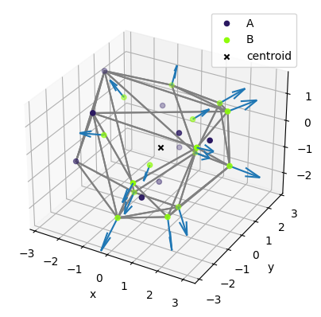

# point_cloud


<!-- WARNING: THIS FILE WAS AUTOGENERATED! DO NOT EDIT! -->

Given a list of 3D points, where each point has an *A* or *B* label,
this module defines a set of functions to calculate new points labeled
*C*, at a fixed distance from each point *B*, and directed outside the
input point cloud. Specifically, first the input point cloud centroid is
calculated. Then, for each *B* point, a new *C* point is determined,
following a prescribed distance D from the point *B*, along the
direction centroid -\> *B*.

## Usage

Documentation can be found hosted on this GitHub
[repository](https://github.com/valentina-lacivita/point_cloud)’s
[pages](https://valentina-lacivita.github.io/point_cloud/).

### Run the module on provided input data using Docker

We have defined a minimalist Docker wrapper that installs this package,
runs it on the input data, and export the results. After cloning this
repo, go to the `docker` folder and run the command:

``` sh
docker compose up --build
```

The files with the output points data and related plot will be exported
to the `data` folder.

### Extra: beyond Docker / module installation via pip

Install latest from the GitHub
[repository](https://github.com/valentina-lacivita/point_cloud):

``` sh
pip install git+https://github.com/valentina-lacivita/point_cloud.git
```

#### Example: running C-points calculation on provided input data

The following command reads the input file containing the labeled *A*
and *B* points, calculates the *C* points and save them in a file on the
same folder (please update the file path accordingly):

``` python
input_data = "../data/cdd.txt"
output_result = "../data/result_C_points.txt"
calculate_C_points(input_data, output_result)
```

    Loading input data from '../data/cdd.txt'...
    Calculate points...
    Saving result data to '../data/result_C_points.txt'...
    Done.

Using optional parameters, one can also plot the point cloud along with
the new *C* vectors by including also a filename for the plot image and
specify a prescribed distance between the points *B* and *C*:

``` python
output_plot = "../data/result_plot.png"
calculate_C_points(input_data, output_result, output_plot_file=output_plot, distance=1.0)
```

    Loading input data from '../data/cdd.txt'...
    Calculate points...
    Saving result data to '../data/result_C_points.txt'...
    Exporting plots to '../data/result_plot.png'...
    Done.



## Development

> For the thought process behind the code, please follow the [core
> notebook](https://github.com/valentina-lacivita/point_cloud/blob/main/nbs/00_core.ipynb).

> To browse the module code itself, please check out
> [core.py](https://github.com/valentina-lacivita/point_cloud/blob/main/point_cloud/core.py)
> and the [core
> documentation](https://valentina-lacivita.github.io/point_cloud/core.html).

### Contributing

#### 1. Setup the dev environment

First checkout the repository and run

``` shell
pipenv install --dev
```

#### 2. Enable the new kernel for the Jupyter notebook

Run in your project folder:

``` shell
pipenv shell
```

This will bring up a terminal in your virtualenv like this:

``` shell
(point_cloud) bash-4.4$
```

In that shell run:

``` shell
python -m ipykernel install --user --name=point_cloud
```

Launch jupyter notebook:

``` shell
jupyter notebook
```

In your notebook, Kernel -\> Change Kernel. Your kernel should now be an
option.

#### 3. Change or add new code

Add or change existing notebook code in `nbs` folder. As you commit the
changes to git a pre-commit hook will automatically generate the `.py`
module code and clean up metadata. To update the readme and run tests,
run

``` shell
nbdev_readme
nbdev_test
```

If dependencies changed, please update the requirements in
`settings.ini` by running:

``` shell
bash update_requirements.sh
```

When the code is pushed to Github it will trigger a CI workflow that
also runs `nbdev_test`. When the code is merged to `main` another
workflow is triggered to update the documentation on Github Pages.
